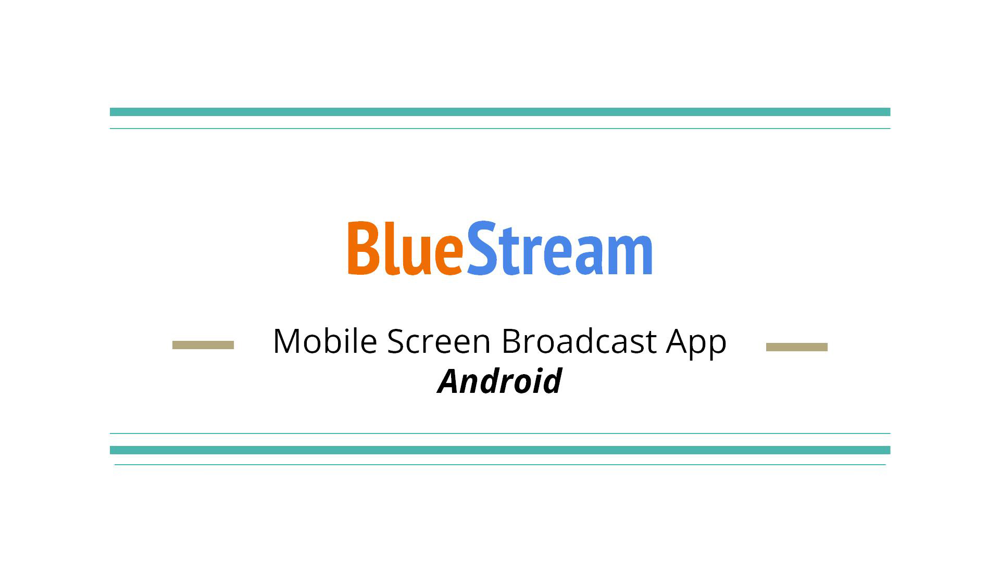
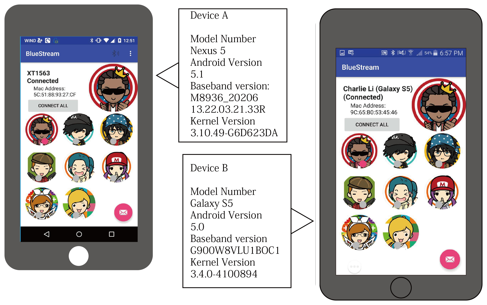
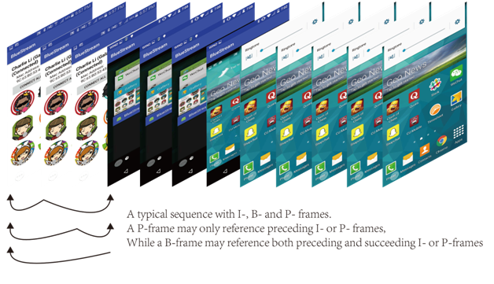
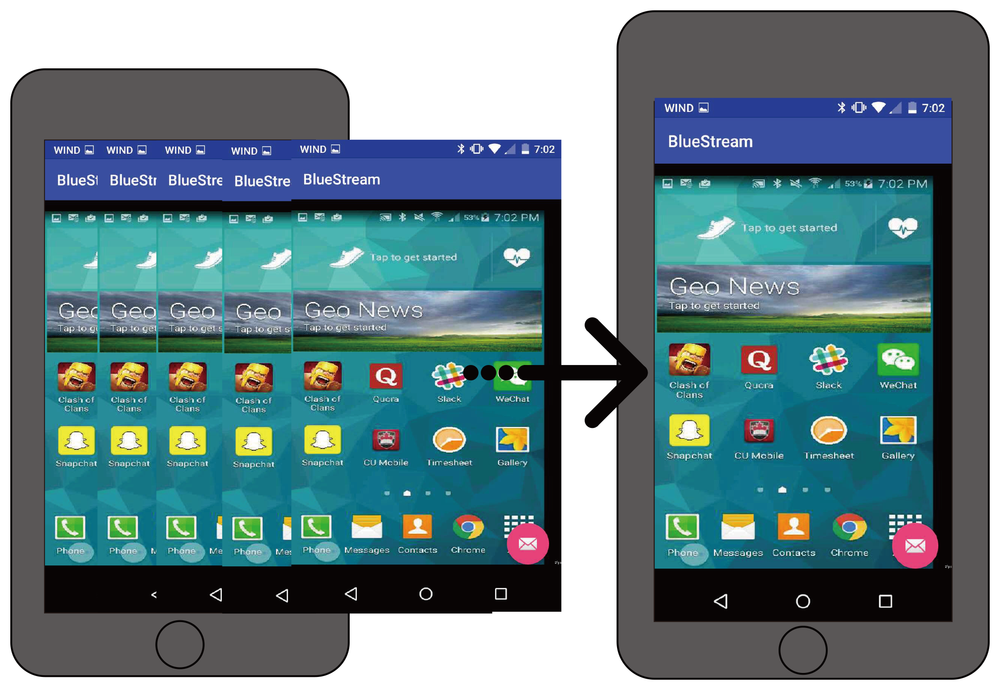

BlueStream
===================================

BlueStream is a mobile screen broadcasting android application that communicates through Bluetooth(BT) wireless technology.

Introduction
------------

This sample should be run on two Android devices at the same time, to boradcasting the mobile screen.

The main functionality that BlueStream provides to the end user is the ability to share the current state of their
display to another user in close proximity over wireless connection. BT is a wireless
technology standard for exchanging data over short distances from device to device over
radio waves. BT utilizes short-wavelength, ultra high frequency (UHF) radio waves which
are a category of electromagnetic radiation with lower signal frequency varying in wave-
lengths. UHF is designated by the international telecommunication union to operate in
frequency ranges of 300 MHz to 3 GHz [14]. Frequencies in this range are also known as
the decimetre band, where the range of the wave signal is between one meter to ten me-
ters. Within this band, resides the infamous 2.4GHz to 2.485GHz range that is reserved
for industrial, scientific, and medical (ISM) radio frequencies, established in 1985 and is
globally unlicensed. BT is designed to work out the shortcomings of its higher frequency,
shorter wavelength sibling, the infrared light, by enabling a faster transfer speed, and
eliminating the need for line of sight communication.

Screenshots
-------------

 
 

Getting Started
---------------

This sample uses the Gradle build system. To build this project, use the "gradlew build" command or use "Import Project" in Android Studio.

Support
-------

If you've found an error in this sample, please file an issue:
https://github.com/ZhangHector/BlueStream

Patches are encouraged, and may be submitted by forking this project and
submitting a pull request through GitHub. Please see CONTRIBUTING.md for more details.
